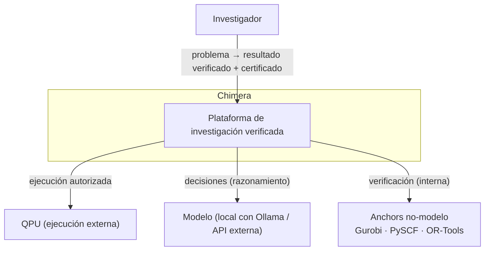
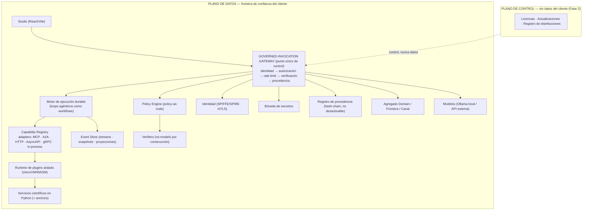
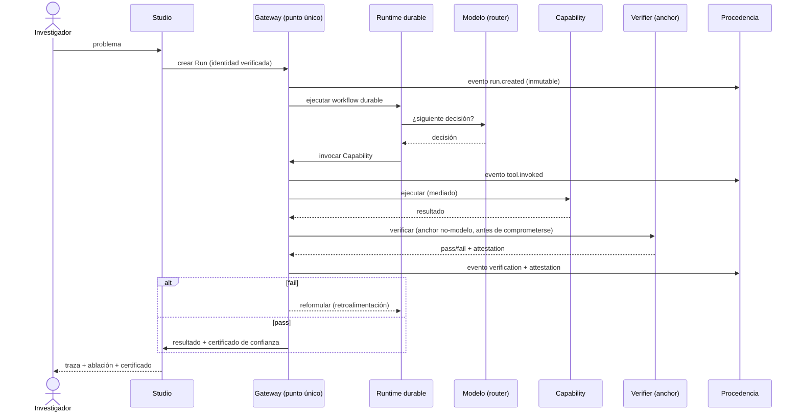

# Chimera — Documento de Arquitectura

_arc42 + C4 + ADRs + Patrones · Reflejo verificable de la base lógica_

> **Estado: VIGENTE-CON-DRIFT (2026-07-30), salvo ADR-001, ADR-002 y ADR-012** (§12, Registro de decisiones) — fijaban núcleo TypeScript/NestJS y runtime Node.js; supersedidos por la decisión de core Python (ver [`arquitectura-python.md`](arquitectura-python.md)). El resto del documento (fundamento lógico, vistas C4, cómo la arquitectura garantiza cada invariante, patrones, riesgos) sigue vigente. **Drift verificado por el censo S1 (D-N13):** §5 pinta un pipeline de gateway de 5 etapas vs las 8 congeladas (freeze §8; `engine/src/blite/gateway/pipeline.py:40-48`) — marca `[S3]` en §5. Ver [`README.md`](README.md) para el índice de autoridad documental.
>
> **Propósito.** Documento de arquitectura autoritativo de Chimera. Define la estructura, los componentes, las decisiones y los patrones del sistema, y demuestra que cada uno es el reflejo de un invariante de la base lógica formal (documento separado: _Base Lógica Formal del Engine_, ver [`base-logica-formal.md`](base-logica-formal.md)).
>
> **Terminología de fases.** **Arquitectura objetivo** (la visión completa del sistema, _target_). **Fase 1** (el incremento inicial, alcance del hackathon). **Fase 2** (los incrementos hacia la arquitectura objetivo). Cobertura: 🟢 completo · 🟡 parcial o dependiente · 🔴 a diseñar en su fase.
>
> **Punto de extensión.** Un puerto (interfaz) diseñado para que su implementación pueda reemplazarse sin modificar el código que la consume. La disciplina central de este documento: **el puerto se diseña para la arquitectura objetivo; la implementación detrás puede ser la mínima de la Fase 1.** Así el sistema crece sin romper contratos.
>
> **Referencias lógicas.** AX (axioma), PR (principio), Inv-E (invariante de egreso), D (definición/concepto), del documento de base lógica.

---

## 1 · Fundamento lógico

La arquitectura no es un diseño libre: es el reflejo verificable del _core_ lógico. Su función es materializar, en componentes y mecanismos concretos, los invariantes que la base lógica define como propiedades. Los invariantes que la arquitectura debe garantizar:

|               | Invariante                                                  | Exigencia sobre la arquitectura                                                          |
| ------------- | ----------------------------------------------------------- | ---------------------------------------------------------------------------------------- |
| **AX1a**      | Identidad                                                   | Toda acción atribuible a un actor único                                                  |
| **AX1b**      | Aislamiento                                                 | Dominios sellados; cruce solo por canal declarado                                        |
| **AX2**       | Meta-auditabilidad                                          | Todo override deja registro inmutable; el registro no se desactiva en silencio           |
| **AX3**       | Mediación                                                   | El modelo no accede al mundo directamente; toda acción pasa por un puerto                |
| **PR1**       | Observabilidad                                              | Toda acción registrada                                                                   |
| **PR2 / PR4** | Verificación                                                | Acción con efecto externo verificada contra un _anchor_ no-modelo antes de comprometerse |
| **PR3**       | Soberanía                                                   | Los datos no cruzan la frontera del dominio sin autorización                             |
| **Inv-E**     | Egreso                                                      | El egreso lo gobierna únicamente la autorización; la verificación nunca lo provoca       |
| **D14–D22**   | Procedencia, Verificación, Soberanía, Confianza, Integridad | Cada concepto tiene reflejo en un componente (Sección 6)                                 |

---

## 2 · Objetivos de calidad y restricciones

**Atributos de calidad** (cada uno sirve a un invariante): verificabilidad (PR2/D-verificación), soberanía (PR3/Inv-E/D19), reproducibilidad (D16), trazabilidad y auditabilidad (AX2/D22), interoperabilidad (D-Capability), evolvabilidad, seguridad (AX1/AX3).

**Restricciones de la Fase 1:** equipo con TypeScript, Python y C#; ventana de aproximadamente 3.5 semanas más el evento; cuatro personas a tiempo parcial. **Restricción de dominio:** el Engine no conoce el dominio científico (QUBO, química cuántica); ese conocimiento vive en las _Capabilities_, no en el núcleo.

---

## 3 · Contexto del sistema (C4 — Nivel 1)

---

## 4 · Estrategia de solución

Decisiones de fondo, cada una trazada al invariante que sirve. (Detalle en Sección 12, Registro de decisiones.)

| Decisión estratégica                                                                                          | Sirve a                                 | Fase | ADR          |
| ------------------------------------------------------------------------------------------------------------- | --------------------------------------- | ---- | ------------ |
| Abstracción **Capability** propia; los protocolos (MCP, A2A, HTTP, AsyncAPI, gRPC, in-process) son _adapters_ | Interoperabilidad sin acoplar el núcleo | 1→2  | 013          |
| **Governed-Invocation Gateway** como punto único de control (_chokepoint_)                                    | AX3, PR2, PR3, Inv-E                    | 1→2  | 014, 024     |
| Motor de ejecución durable (los loops agénticos son _workflows_)                                              | Reproducibilidad (D16), robustez        | 2    | 015          |
| Registro de procedencia a prueba de manipulación (_hash-chain_)                                               | AX2, D14–D16, D22                       | 2    | 016          |
| **`override` como evento de primera clase + registro no desactivable**                                        | AX2 (cierre de brecha)                  | 1→2  | 022          |
| **Agregado `Domain` / frontera / canal**                                                                      | AX1b (cierre de brecha)                 | 1→2  | 023          |
| **Policy-as-code** (verificación y autorización declarativas)                                                 | PR2/PR4, control (D19)                  | 2    | 017          |
| Capacidades + bóveda de secretos + _zero-trust_                                                               | AX1, seguridad                          | 1→2  | 018          |
| Plano de control sin datos / plano de datos soberano                                                          | PR3, D19, autonomía                     | 2    | 019          |
| Aislamiento de plugins (microVM/WASM)                                                                         | AX3, Inv-E                              | 2    | 020          |
| **Certificado de confianza como salida de primera clase**                                                     | D20 + demostración                      | 1→2  | 025          |
| **Camino de modelo local de primera clase**                                                                   | Autonomía (D19)                         | 1→2  | 026          |
| **El puerto `Verifier` excluye modelos por construcción**                                                     | Verificación ≠ coherencia (D18)         | 1    | 027          |
| Núcleo en TypeScript/NestJS; ciencia en Python; monolito modular; PostgreSQL + pgvector; cola nativa de Node  | Restricciones de equipo                 | 1    | 001–003, 012 |

---

## 5 · Vista de componentes (C4 — Nivel 2, arquitectura objetivo)

**[S3 2026-07-30]** El rótulo del gateway en el diagrama (identidad → autorización → rate-limit → verificación → procedencia, 5 etapas) es pre-freeze: el pipeline congelado y el código real tienen **8 etapas** — identity → authorization → guardrails → provenance:pre → mediation → verification → provenance:post → egress (freeze §8; `engine/src/blite/gateway/pipeline.py:40-48`).

**Subconjunto de la Fase 1** (lo que se construye en el incremento inicial, con implementación mínima): Studio, Gateway (pipeline mínimo pero punto único de control), Runtime (loop con retroalimentación), Capability Registry (adapters MCP y HTTP), Verifiers (anchors internos), Event Store (PostgreSQL), Identidad (JWT), Servicios científicos. **Semillas de Fase 2:** `override` como evento, agregado `Domain` (un solo dominio), certificado de confianza (JSON), puerto `Verifier` que excluye modelos.

---

## 6 · Cómo la arquitectura garantiza cada invariante

Esta es la sección central: cada invariante, el componente que lo garantiza, el mecanismo, y el diseño que cierra la brecha detectada en la auditoría de trazabilidad.

**AX1a — Identidad.** Componente: Identidad (SPIFFE en Fase 2, JWT en Fase 1) + Gateway. Mecanismo: toda invocación entra por el gateway, que exige identidad verificada y la estampa; sin identidad, se rechaza. El Event Store registra el actor de cada acción. Estado: 🟡→🟢.

**AX1b — Aislamiento (cierre, ADR-023).** Componente: agregado `Domain` (entidad con dueño) + declaración de canales + verificación en el gateway. Mecanismo: una acción cuyo actor pertenece a un dominio y toca datos de otro se rechaza salvo que exista un canal declarado entre ambos. El split plano de control / plano de datos da la frontera de nivel superior; el agregado `Domain` da la frontera interna. En Fase 1 hay un solo dominio (el constructo existe aunque el dominio sea único). Estado: 🔴→🟢.

**AX2 — Meta-auditabilidad (cierre crítico, ADR-022).** Componente: registro de procedencia a prueba de manipulación + Gateway. Mecanismo, en tres piezas: (1) `override` es un tipo de evento de primera clase; toda mutación de política, configuración o _guardrail_ se modela como un evento `override` que el gateway captura siempre; (2) toda relajación pasa por el gateway, sin ruta lateral; (3) el registro es no desactivable: la desactivación del subsistema de registro es ella misma un evento `override` que se escribe _antes_ de surtir efecto. Es la brecha más importante a cerrar, porque AX2 es lo que vuelve detectable toda relajación: sin él, los principios PR1–PR4 dejan de ser seguros y la integridad (D22) deja de ser auditable. Estado: 🔴→🟢 (en Fase 1, semilla: `override` como evento sobre PostgreSQL, sin _hash-chain_ todavía).

**AX3 — Mediación.** Componente: Gateway (punto único de control) + aislamiento de plugins. Mecanismo: el modelo se ejecuta en _sandbox_ sin ruta directa al mundo; toda acción del modelo (datos, herramientas, efectos) pasa por el gateway, que es el puerto. Dependencia crítica: la mediación es tan fuerte como el _sandbox_ (ADR-020 la sostiene). Estado: 🟡→🟢.

**PR1 — Observabilidad.** Componente: Event Store. Mecanismo: cada acción emite un evento (Event Sourcing). Nota: su relajación segura depende de AX2. Estado: 🟢.

**PR2 / PR4 — Verificación.** Componente: Verifiers (no-modelo, ADR-027) + Policy Engine (qué _anchor_ aplica, Fase 2) + Gateway (compuerta). Mecanismo: el gateway enruta toda acción con efecto externo por la compuerta de verificación _antes de comprometerse_; el verifier contrasta contra un _anchor_ no-modelo. El _commit_ lo controla el gateway, no el modelo (recuperación gobernada). Para PR4 (irreversible que afecta a un tercero): el gateway detecta y exige verificación o bloquea; una capa de reversibilidad convierte lo irreversible en reversible. Estado: 🟡→🟢.

**PR3 — Soberanía e Inv-E — Egreso.** Componente: Gateway (punto único de egreso, ADR-024) + agregado `Domain` + split de planos. Mecanismo: el gateway es la única ruta de egreso; antes de que un dato cruce la frontera, exige autorización del dueño del dominio. Por Inv-E, la autorización es la _única_ condición de egreso; la verificación nunca lo provoca (no existe una rama "verificar enviando datos afuera"). Consecuencia: como el egreso solo depende de autorización previa, una instrucción inyectada no puede provocar fuga de datos. Dependencia: requiere que el gateway sea un punto de control real (_sandbox_, ADR-020). Estado: 🟡→🟢.

**Conceptos (D14–D22):**

- _Procedencia_ (D14–D16): Event Store (reconstruible por _replay_ del motor durable) + _hash-chain_ (inmutable, Fase 2). 🟡→🟢.
- _Verificación_ (D17–D18): Verifiers no-modelo (ADR-027); la arquitectura garantiza por construcción que un verifier no es un modelo. 🟢.
- _Soberanía_ (D19): custodia (PR3) + control (Policy Engine) + autonomía (camino de modelo local, ADR-026; sin esto, usar una API externa rompe la autonomía). 🟡.
- _Confianza_ (D20): el **certificado de confianza** (ADR-025), artefacto de primera clase que empaqueta identidad del actor + _hash_ de procedencia + _attestation_ de verificación, emitido por cada resultado. Refleja D20 y es el resultado central de la demostración. 🟡→🟢.
- _Integridad_ (D22): garantizada por AX2; cerrar AX2 la cierra. 🔴→🟢.

---

## 7 · Vista de runtime — el _run_ verificado

El gateway aparece en cada paso: estampa identidad, media, verifica antes de comprometerse y registra procedencia. Esto es AX1 + AX3 + PR2 + PR1 + Inv-E operando como un solo pipeline.

---

## 8 · Vista de despliegue

| Aspecto     | Fase 1                                              | Fase 2 (objetivo)                                                                   |
| ----------- | --------------------------------------------------- | ----------------------------------------------------------------------------------- |
| Topología   | Un nodo, un dominio, Docker Compose local           | Plano de control (sin datos) + plano de datos soberano en el entorno del cliente    |
| Soberanía   | Local; la QPU es ejecución externa autorizada       | Plano de datos en la frontera del cliente; el plano de control nunca ve datos (D19) |
| Modelos     | Local (Ollama) para autonomía; API externa opcional | Modelo local de primera clase (ADR-026)                                             |
| Aislamiento | Servicios separados                                 | microVM/WASM por plugin (ADR-020)                                                   |

---

## 9 · Conceptos transversales

**Las tres formas de integrar agentes externos se unifican en `Capability`.** Nativo (loop del Engine), alojado en el perímetro, o herramienta/par — todos son una `Capability` con distinto _adapter_ y _backend_. La unificación está en la gobernanza (el gateway), no en el protocolo (ADR-013/014).

**Leyes y Parámetros.** Las Leyes son los invariantes inviolables (AX1–AX3) más los principios activos por defecto. Los Parámetros son la configuración del usuario (modelo, _harness_, herramientas, _prompts_). El gateway hace cumplir las Leyes; el usuario configura los Parámetros.

**Mapa de protocolos.** MCP (agente → herramienta), A2A (agente → agente), AsyncAPI (eventos, _webhooks_, _sockets_), OpenTelemetry (observabilidad), SPIFFE (identidad). Todos son _adapters_ en el borde del sistema, nunca entre componentes internos.

**Seguridad como capas transversales.** Identidad y permisos (_guards_), verificación (_interceptor_ en el gateway), aislamiento (_sandbox_) se aplican de forma uniforme, no endpoint por endpoint.

---

## 10 · Restricciones de diseño al escalar

La arquitectura objetivo no viola ningún axioma al crecer, pero existen cinco zonas donde escalar tensiona un invariante. Cada una exige una regla de diseño explícita (estas no son ADRs nuevos; son condiciones sobre los componentes existentes).

1. **Ejecución durable y AX1.** El actor de una actividad reanudada tras una caída es el mismo que inició el Run; la identidad se hereda del Run, no del _scheduler_. El motor durable es infraestructura, nunca un actor.
2. **Plano de control y PR3.** El plano de control intercambia con el plano de datos únicamente señales de control sin contenido del cliente (licencias, versiones, comandos, métricas agregadas no identificantes). El flujo de datos es estructuralmente unidireccional; el plano de datos no expone endpoints que devuelvan contenido hacia arriba.
3. **Replicación del registro y PR3.** El respaldo del registro de procedencia ocurre dentro de la frontera del dominio (o a un destino que el dueño autorizó). La verificación externa de integridad se hace compartiendo solo _hashes_, nunca contenido.
4. **Policy Engine y los axiomas.** El Policy Engine puede configurar Parámetros y relajar Principios (con traza), pero no puede tocar Axiomas. AX1–AX3 no son entradas configurables; están compilados en el gateway, fuera del alcance del Policy Engine.
5. **Snapshots y reconstrucción.** Un _snapshot_ es una optimización de lectura, no un reemplazo del registro. El log de eventos inmutable se conserva completo como fuente de verdad; el _snapshot_ acelera, no sustituye.

**Principio de no-elusión** (generalización de las cinco reglas). Ningún componente, por más que escale el sistema, puede introducir una ruta que evada el punto donde un invariante se hace cumplir. Las garantías son puntos únicos de control; los componentes nuevos pasan _a través_ de ellos, nunca _alrededor_.

---

## 11 · Patrones por componente

Cada patrón responde a una presión nombrada. Existen dos tipos de presión, y ambas son legítimas: la **presión de forma** (que la pieza tenga la estructura correcta del destino, presente desde la Fase 1) y la **presión de escala** (volumen, concurrencia, durabilidad, presente en la Fase 2). Solo se evita la complejidad que no responde a ninguna presión.

| Componente                  | Patrones                                                                    | Presión que los justifica                                                     |
| --------------------------- | --------------------------------------------------------------------------- | ----------------------------------------------------------------------------- |
| Governed-Invocation Gateway | Chain of Responsibility (pipeline de etapas) + Facade                       | Componer concerns transversales de forma uniforme; un único puerto de entrada |
| Capability Registry         | Registry + Adapter (protocolos) + Factory + Strategy (modos de interacción) | Catálogo extensible; transporte intercambiable                                |
| Motor de ejecución durable  | Saga / Process Manager + State + Command                                    | Flujos largos reanudables, compensables, con _replay_                         |
| Model Router                | Strategy + Factory                                                          | Modelo intercambiable; _local-first_ por autonomía                            |
| Verification                | Strategy (verifiers) + Specification (política)                             | Anchors intercambiables; política separada del mecanismo                      |
| Policy Engine               | Specification / policy-as-code                                              | Reglas declarativas y auditables                                              |
| Event Store                 | Event Sourcing + Repository + CQRS (proyecciones)                           | Reproducibilidad; lectura separada de escritura                               |
| Registro de procedencia     | Merkle / hash-chain + append-only                                           | Resistencia a manipulación (D14, AX2)                                         |
| Agregado Domain             | Aggregate (DDD) + verificación de frontera                                  | Fronteras de confianza de primera clase (AX1b)                                |
| Bóveda, Modelos, Anchors    | Adapter detrás de puerto (hexagonal)                                        | Implementación intercambiable                                                 |
| Runtime de plugins          | Sandbox / aislamiento de plugins                                            | El host no se compromete (AX3, Inv-E)                                         |
| Todo el núcleo              | Inyección de dependencias (NestJS)                                          | Cableado testeable, sin estado global                                         |
| Studio                      | Componentes + Observer (suscripción al stream)                              | Reflejar el _run_ en vivo                                                     |

**El puerto se diseña para la arquitectura objetivo; la implementación de la Fase 1 puede ser la mínima.** Cuatro puntos de extensión no pueden omitirse aunque su implementación inicial sea mínima, porque adaptarlos después es costoso: el gateway como punto único de control, `override` como tipo de evento, el puerto `Verifier` que excluye modelos, y el puerto `append()` con forma de registro a prueba de manipulación.

---

## 12 · Registro de decisiones (ADRs)

ADRs 001–012 (base) + 013–021 (arquitectura objetivo) + 022–027 (cierre de brechas). Forma: decisión · invariante que sirve · fase.

| ADR     | Decisión                                                                            | Sirve a                       | Fase |
| ------- | ----------------------------------------------------------------------------------- | ----------------------------- | ---- |
| 001     | Núcleo TypeScript/NestJS; ciencia Python/FastAPI                                    | Restricción de equipo         | 1    |
| 002     | Runtime sobre Node.js (Bun solo para _tooling_)                                     | Restricción de equipo         | 1    |
| 003     | Monolito modular                                                                    | Restricción de equipo         | 1    |
| 004     | El Engine es dueño del loop (agentes nativos delgados)                              | AX3                           | 1    |
| 005→013 | Tres formas de integración → abstracción **Capability**; protocolos como _adapters_ | Interoperabilidad sin acoplar | 1→2  |
| 006     | Adoptar estándares abiertos, no inventar propietarios                               | No-dependencia                | 1    |
| 007→017 | Verificación anclada → **policy-as-code** + _attestations_                          | PR2/PR4, D18                  | 1→2  |
| 008     | La ciencia es una Capability, no parte del núcleo                                   | Genericidad                   | 1    |
| 009→016 | Event Sourcing → **registro a prueba de manipulación**                              | AX2, D14–D16                  | 1→2  |
| 010     | Separación Leyes / Parámetros                                                       | AX1–AX3 vs configuración      | 1    |
| 011     | Profundidad sobre amplitud (un servicio QUBO completo)                              | Foco                          | 1    |
| 012     | PostgreSQL + pgvector + cola nativa de Node                                         | Restricción de equipo         | 1    |
| 014     | **Governed-Invocation Gateway** unificado                                           | AX3/PR2/PR3/Inv-E             | 1→2  |
| 015     | Motor de ejecución durable                                                          | D16, robustez                 | 2    |
| 018     | Capacidades + bóveda + _zero-trust_                                                 | AX1, seguridad                | 1→2  |
| 019     | Plano de control sin datos / plano de datos soberano                                | PR3, D19                      | 2    |
| 020     | Aislamiento microVM/WASM                                                            | AX3, Inv-E                    | 2    |
| 021     | Event Store con streams/snapshots/proyecciones                                      | D16, escalabilidad            | 2    |
| **022** | `override` como evento de primera clase + registro no desactivable                  | AX2 (cierre)                  | 1→2  |
| **023** | Agregado `Domain` / frontera / canal                                                | AX1b (cierre)                 | 1→2  |
| **024** | Gateway como punto único de egreso y acción externa                                 | AX3/PR3/Inv-E                 | 1→2  |
| **025** | Certificado de confianza como salida de primera clase                               | D20 + demostración            | 1→2  |
| **026** | Camino de modelo local de primera clase                                             | Autonomía (D19)               | 1→2  |
| **027** | El puerto `Verifier` excluye modelos por construcción                               | D18                           | 1    |

---

## 13 · Riesgos y glosario

**Riesgos principales.** El punto único de control es el supuesto más cargado (sostiene AX3, PR3 e Inv-E); si algún componente lo evade, tres invariantes se rompen — mitigación: _sandbox_ desde el diseño. AX2 sin cerrar invalida el esquema de relajación con traza — mitigación: `override` como evento desde la Fase 1. La autonomía se rompe si se depende de una API externa — mitigación: camino de modelo local de primera clase.

**Glosario.** Los términos del _core_ (actor, acción, procedencia, _anchor_, dominio, override, confianza) están definidos en el documento de base lógica (D1–D22). _Capability_, gateway, distribución, certificado de confianza y `Domain` están definidos en este documento.

---

> **Nota original.** Documento de arquitectura completo, reflejo verificable de la base lógica. La arquitectura objetivo es el diseño maestro; la Fase 1 es su subconjunto marcado. Los seis ADRs 022–027 cierran las brechas detectadas en la auditoría de trazabilidad. Cada decisión está trazada a su invariante. Las restricciones de la Sección 10 condicionan los incrementos de Fase 2.
